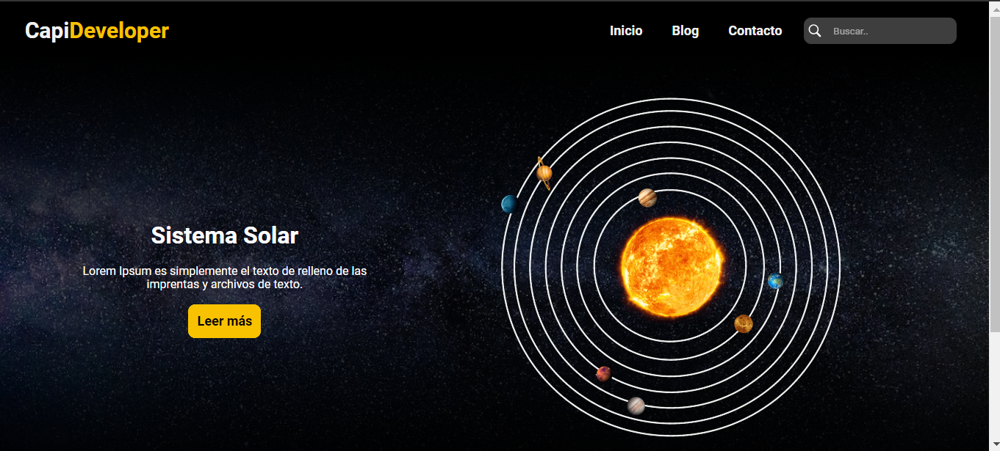
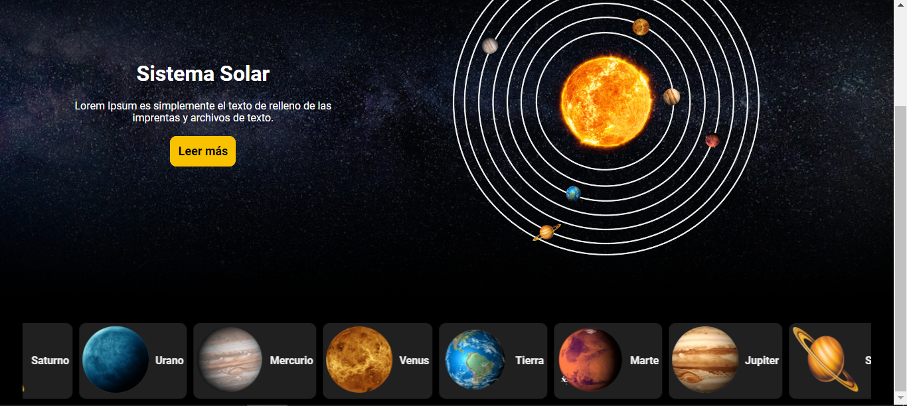

# PAGINA DO SISTEMA SOLAR
☑️PAGINA HOME E MENU DO SISTEMA SOLAR.

    
   

## DESCRIÇÃO:
O aplicativo consiste em uma página da web que apresenta informações sobre o Sistema Solar. Ele inclui:

1. **Menu de Navegação**: Permite aos usuários navegar pelas diferentes seções da página, como "Inicio", "Blog" e "Contacto".

2. **Conteúdo Principal**: Exibe uma lista de planetas com imagens e seus respectivos nomes. Isso oferece aos usuários uma visão geral dos planetas que compõem o Sistema Solar.

3. **Barra Lateral**: Apresenta informações adicionais sobre o Sistema Solar, como um título e uma breve descrição. Também oferece um botão "Leer más" (ler mais) para os usuários que desejam obter mais detalhes.

4. **Estilização e Comportamento Interativo**: Utiliza arquivos de estilo CSS para estilizar a página e garantir uma aparência consistente. Além disso, inclui um arquivo JavaScript que controla a exibição de um indicador de carregamento (spinner).

## NÃO SABE?
- Entendemos que para manipular arquivos em `HTML`, `CSS` e outras linguagens relacionadas, é necessário possuir conhecimento nessas áreas. Para auxiliar nesse aprendizado, oferecemos cursos gratuitos disponíveis:
* [CURSO DE HTML E CSS](https://github.com/VILHALVA/CURSO-DE-HTML-E-CSS)
* [CURSO DE JAVASCRIPT](https://github.com/VILHALVA/CURSO-DE-JAVASCRIPT)
* [CONFIRA MAIS CURSOS](https://github.com/VILHALVA?tab=repositories&q=+topic:CURSO)

## CREDITOS:
- [PROJETO CRIADO PELO "CapiDeveloper"](https://github.com/CapiDeveloper/Proyecto-8-CapiDev)
- [PROJETO EDITADO PELO VILHALVA](https://github.com/VILHALVA)
